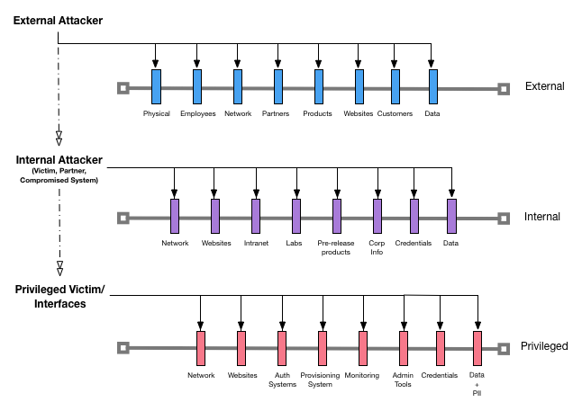

# The Raindance Project

Over the years, we all collect skills in building up attacks and details to help defend and ruggedize our software.  The goal of this project is to figure out how to simplify attack modeling for developers.  And to take on the challenge of making it possible to achieve a good amount of attack modeling within 15 minutes in order to fit within a continuous delivery process. 

## Hypothesis

Using github and developing a common components model, we think we can solve for a just enough attack modeling approach that makes it possible to create a better security understanding and strategy for most applications.  

## Approach

This Attack Map approach builds upon the concept that software projects should contain security information and a common understanding of attack surface.  In a software project that employs this methodology, you would find a SECURITY.md and ATTACKS.md file within the root of the project.  Focusing on the ATTACKS.md file, we believe it is necessary to include a thumbnail sketch along with potential attack information considered during the design, implementation and operations of the software project.  Further, this Standard is meant to provide a library for commonly implemented patterns and the potential pitfalls that should be considered in order to reduce the effort and time required to identify an attack model.

Systems and services are commonly available from an external, internal, or privileged vantage point.  We have chosen these levels as top level entry points within our methodology because it simplifies the initial classification of attack surface.  Here is a reference diagram to help with understanding how Attack Maps work:

## Getting Started

### 1. Choose an attack path

Determine if your system will be made available externally, internally, or as a privileged system.  Choose the path that closely aligns with your choice of path to begin your attack map.

If you have multiple classifications, always choose the higher class.  For example, if you have a website that will be used both externally and internally, you will choose the external path to start your map.  Complex attack maps will be supported in a later variation of this project.

### 2. Pick a template from the templates library

Right now we have focused on supplying only one template to support basic attack maps.  You can find it in the [templates](templates) directory.

### 3. Set up ATTACKS.md in the root of your project

Describe your project using the template you've chosen and save it as ATTACKS.md in the root of your project.  This file will continue to evolve with your project and when you gain security insights from the instrumentation constructed to support the security feedback loop.

### 4. Link Attack Definitions to ATTACKS.md

Create an /attacks folder in your Test library to have your .attack files run during your build process and/or for run time scans to be kicked off routinely.  Link the .attack to test controls and mitigations routinely.

## Contribute
Raindance is in early stages of being developed and can certainly use some collaboration.  We're using Slack to start working on this during our free time.  All help is welcome and please realize we are learned how to Open Source, so please be patient with us.

