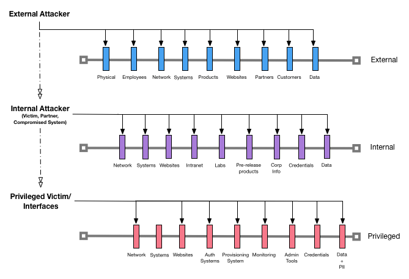

# The Raindance Project

Over the years, we all collect skills defending our software against attackers and learn the details necessary to make our software more resillient.  The goal of this project is to figure out how to simplify attack modeling for developers by building out component parts and an inheritence model that can be referenced for common attack scenarios and security testing.  Further, we are taking on the challenge of making it possible for a developer to spend 15 minutes developing an attack map that they can keep up to date as their software changes to fit within a continuous delivery process. This will be no small task and we will use what we know already to build out this capability day by day so that we can invite a community of practitioners to help us scale.  We are calling this approach: **Attack Maps**. This methodology is not a replacement for other security modeling techniques but is necessary for the DevSecOps approach to function well in most organizations.

## Hypothesis

Using github and developing a common attack component model, we think we can solve for "just enough"" attack mapping to make it possible for developers to get a better sense of how their software will survive in the wild.  The intent of this project is to simplify and focus on how an attacker approaches breaking into software and how it will eventually mesh with Threat Modeling.  

## Approach

The Attack Map approach builds upon the concept that software projects should contain security information and a common understanding of attack surface.  In a software project that employs this methodology, you would find a SECURITY.md and ATTACKS.md file within the root of the project.  Focusing on the ATTACKS.md file, we believe it is necessary to include a thumbnail sketch along with potential attack information considered during the design, implementation and operations of the software project.  Further, this Standard is meant to provide a library for commonly implemented patterns and the potential pitfalls that should be considered in order to reduce the effort and time required to identify an attack model.

We have narrowed our approach for prioritization of common attacks down to three attacker vantage points: external, internal, or privileged.  We have chosen these levels as top level entry points within our methodology because it simplifies the initial classification of attack surface.  Here is a reference diagram to help with understanding how Attack Maps work:

We will begin building out this project using human readable diagrams and dialogue with the intention of automation starting with this top-level depiction.  The intention is to build out a common set of basic building blocks first and then make it possible for more complex scenarios over time.

## Surface
Attack surface is the entry point for Raindance.  This section describes the top-level for the project and gives you a starting point for your work.   

* #### [External](patterns/surface/external/README.md)

	External assets are intentionally or unintentionally exposed for public use or consumption.  Assets that are intentionally exposed publicly are commonly prepared for public access but may not have a full understanding of how they might be abused.  Assets that are unintentionally exposed are commonly not prepared for public access and have attack surface which is more easily abused.

* #### [Internal](patterns/surface/internal/README.md)

	Internal assets are protected assets that are commonly described under an "ownership" model. Internal assets are not generally exposed to the public and usually include security controls to limit exposure.  Physical and logical boundaries, authentication, and authorization controls are commonly deployed to ensure that only trusted individuals can consume or use these assets.

* #### [Privileged](patterns/surface/privileged/README.md)
	
	Privileged assets are intentionally well-protected and are certainly not intended for public consumption.  These assets are "handled" by trusted individuals with specified privileges honored by security controls once identification is presented for authorized access to be confirmed.
	
## Assets
Assets are the component parts that make up organizations, products, services and other compilations that create value.  Assets are considered property that is owned by an organization or person.

## Attacks
Attacks are steps in an abuse case or exploit or kill-chain that lead to compromise.

* #### [Reconnaissance]()

	Reconnaissance is the act of collecting information to uncover weaknesses or relationships between assets which could be exploited.  This is a preliminary step for most attacks and helps an adversary to uncover a successful attack strategy.

* #### [Testing]()

	Information from reconnaissance often needs to be tested to confirm whether a weakness exists.  Adversaries need to probe to gather details for their attack.  Asset ownership and organizational boundaries can help to surface an attackers tests or help to hide them.

## Mitigations
Every organization or person has the ability to reduce business risks developed during the value creation process.  Mitigating controls are commonly put in place to make an attack difficult.

