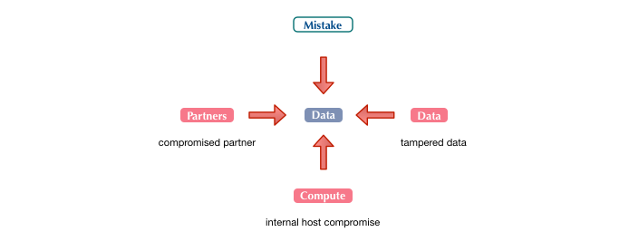

# Surface

We are intentionally reducing complexity in our approach at the top level to make it possible to create attack models in as little as 15 minutes. In other words, we think its important to keep things simple and iterative.

Attack Maps are a work in progress and so its this taxonomy.  We will continue to evolve and grow the framework over time and with contributions.  Our intention is to make use of other existing methods and information available (ex. CAPEC, STRIDE, etc.) to help make this system work for quick attack modeling.

## Lucky or Targeted
The entry point for most attacks is either a lucky find or a targeted attempt. Knowing which of these you are worried about and how is essential in being able to prepare a set of mitigations and appropriate defenses.  A lucky adversary often operates very different from a targeted adversary.  Namely, a lucky adversary tends to find something that was missed or unintended with the goal of understanding where it could lead.  A targeted attacker may have an intended goal and requires a specific set of attacks to be successful to gain access to or information about an intended target.

Some environments make it very difficult to determine whether an adversary is lucky or targeted.  For example, most cloud environments do not provide enough detail to understand whether your asset/target has been identified from a lucky find or targeted reconnaissance.  Similarly, there are combination style attacks that start out lucky with the intention of selling access and entry points to targeted attackers. 

## Enumerating Surface
Enumerating attack surface requires understanding what potential attacks on other resources can do within the trust model that has been established.  Using a simple diagram, you can understand how other resources can be used to further reduce the controls around a specific asset.  Here is a basic enumeration diagram:

Every environment has different and components will be implemented according to business purpose. There are no bullet-proof environments.  We have discovered that keeping attack surface controlled and blast radius contained is often better than attempting to keep attack surface small.  However, the designer is responsible for understanding both considerations, providing rationale and identifying mitigations to support the choice in path.  What works for one environment may not work for others which is why Security is so hard.  

## Surface Entry Points

Using this methodology, attack surface is classified at a top-level as: External, Internal or Privileged.  These entry points provide a vantage point to show the flow and up-leveling of access or attack path: 

* #### [1. External](external/README.md)

	External assets are intentionally or unintentionally exposed for public use or consumption.  Assets that are intentionally exposed publicly are commonly prepared for public access but may not have a full understanding of how they might be abused.  Assets that are unintentionally exposed are commonly not prepared for public access and have attack surface which is more easily abused.

* #### [2. Internal](internal/README.md)

	Internal assets are protected assets that are commonly described under an "ownership" model. Internal assets are not generally exposed to the public and usually include security controls to limit exposure.  Physical and logical boundaries, authentication, and authorization controls are commonly deployed to ensure that only trusted individuals can consume or use these assets.

* #### [3. Privileged](privileged/README.md)
	
	Privileged assets are intentionally well-protected and are certainly not intended for public consumption.  These assets are "handled" by trusted individuals with specified privileges honored by security controls once identification is presented for authorized access to be confirmed.
